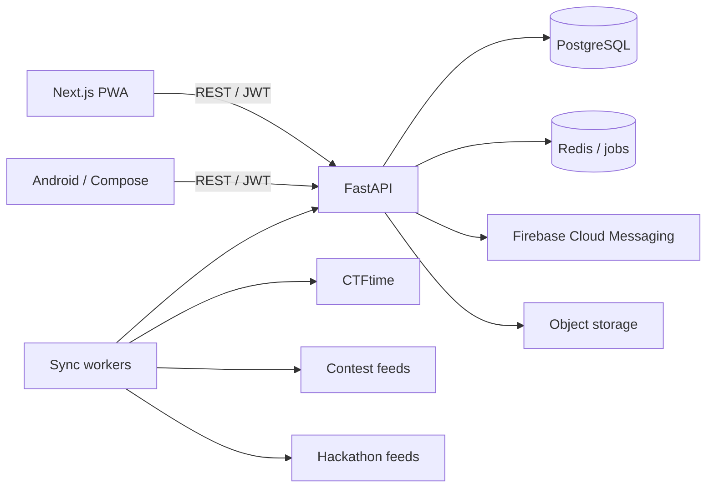
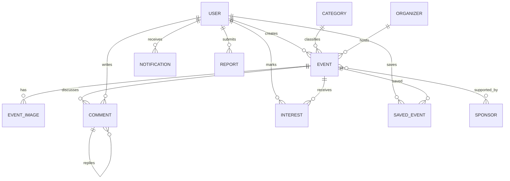

# Event Bazar architecture

The web and Android clients share versioned API contracts. FastAPI owns authorization,
moderation, event state and notification preferences. Background workers normalize and
upsert public-source events by `(source, external_id)`. PostgreSQL is authoritative;
Redis, object storage and FCM are replaceable infrastructure adapters.

## Data model

## Trust boundaries

- Public submissions always enter `pending`; only moderation promotes them.
- OAuth tokens and passwords never reach the clients' persistent application state.
- External HTML is normalized as plain text/validated Markdown before persistence.
- Imported URLs are validated, outbound fetches use explicit source allowlists, and
  scheduled jobs are isolated from request workers.

